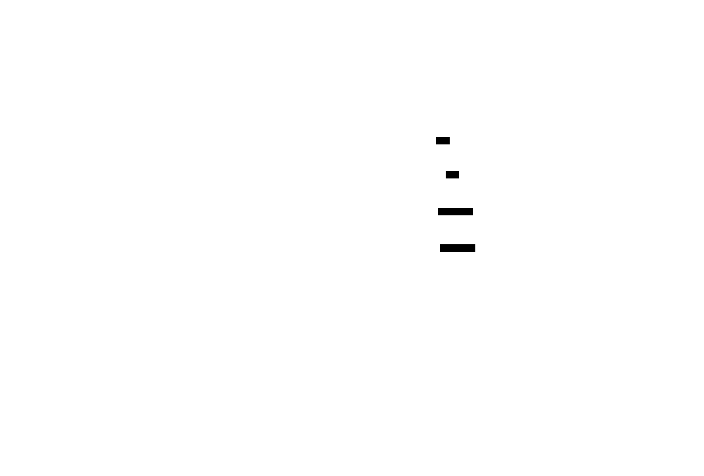

<p align="center">
  <h1 align="center">agentwise</h1>
  <p align="center">
    <strong>The fast, offline security scanner for AI agent configurations.</strong>
  </p>
  <p align="center">
    <a href="https://github.com/brandonwise/agentwise/actions"></a>
    <a href="https://github.com/brandonwise/agentwise/releases"></a>
    <a href="#license"></a>
    <a href="https://github.com/brandonwise/agentwise/stargazers"></a>
  </p>
</p>

---

Think `npm audit`, but for MCP servers and AI agents.

```
$ agentwise scan .

  ╔══════════════════════════════════════════════════════════════╗
  ║  agentwise v0.1.0                                          ║
  ║  MCP Security Scanner                                      ║
  ╚══════════════════════════════════════════════════════════════╝

  ● Scanned 3 configs (12 servers) in 4ms

  ┌──────────────────────────────────────────────────────────────┐
  │  ■ 3 critical  ■ 5 high  ■ 7 medium  ■ 0 low               │
  └──────────────────────────────────────────────────────────────┘

  ✖ CRITICAL  .mcp.json → filesystem  AW-002
    Filesystem server with dangerous root access
    Fix: Add "allowedDirectories" to restrict to project directories

  ✖ CRITICAL  .mcp.json → quickbooks  AW-001
    No authentication on remote MCP server
    Fix: Add authentication via env vars (AUTH_TOKEN, API_KEY, etc.)

  ▲ HIGH      .mcp.json → filesystem  AW-006
    CVE-2025-53110: Path traversal in server-filesystem <0.6.3
    Fix: Upgrade to >=0.6.3

  ╔══════════════════════════════════════════════════════════════╗
  ║  Score: 12/100  ░░░░░░░░░░░░░░░░░░░░░░░░░░░░░░  Grade: F   ║
  ╚══════════════════════════════════════════════════════════════╝
```

## How it works

<p align="center">
  
</p>

## Why agentwise?

30+ CVEs against MCP servers in the last 60 days. 36% of MCP servers ship with zero authentication. Your AI agent setup is probably vulnerable.

Every existing scanner is Python, JavaScript, or TypeScript. They need `pip install` or `npm install`, pull dozens of dependencies, and some require LLM API calls that cost money per scan.

|  | agentwise | Snyk agent-scan | Cisco mcp-scanner | mcp-shield |
|--|-----------|-----------------|---------------------|------------|
| Language | Rust | Python | Python | TypeScript |
| Install | Single binary | pip / uvx | pip | npm |
| Speed class | Milliseconds | Seconds | Seconds | Seconds |
| Offline | Yes | No | No | Yes |
| EPSS scoring | Yes | No | No | No |
| Supply chain | Yes | No | No | No |
| deps.dev | Yes | No | No | No |

## Performance (measured)

Measured on macOS arm64, release build, using `hyperfine`.

### agentwise scan latency

| Command | Mean time |
|---|---:|
| `agentwise scan testdata/vulnerable-mcp.json` (5 servers) | **3.2 ms** |
| `agentwise scan research/configs/` (109 servers) | **3.9 ms** |

### Quick head-to-head (same vulnerable fixture)

| Tool | Mean runtime |
|---|---:|
| `agentwise` | **3.1 ms** |
| Cisco `mcp-scanner` (`--analyzers yara`) | **2.68 s** |
| `mcp-shield` (default run) | **60.62 s** |

Notes:
- These are default CLI runs on the same fixture (`testdata/vulnerable-mcp.json`).
- Some tools attempt live server connections by design, which increases runtime.
- Reproduce locally with the benchmark commands in [`research/benchmarks.md`](research/benchmarks.md).

## Real-world findings snapshot

From a scan of **109 MCP server entries** collected from public GitHub configs + official docs:

- **130 total findings** (13 high, 117 medium)
- **100%** missing tool allowlists (AW-007)
- **8.26%** had unrestricted filesystem access (AW-002)
- **1.83%** exposed hardcoded secrets (AW-004)
- Insecure HTTP transport still present in public configs (AW-005)

Full methodology, source attribution, and raw output are in [`research/FINDINGS.md`](research/FINDINGS.md) and [`research/scan-results.json`](research/scan-results.json).

## Trust signals

- **4.0 MB** release binary
- **203/203 tests passing**
- **0 clippy warnings** with `-D warnings`
- **0 known Rust dependency vulnerabilities** (`cargo audit`)

## Install

### From crates.io (coming soon)

`agentwise` is not published on crates.io yet.

### Install with Cargo today

```bash
cargo install --git https://github.com/brandonwise/agentwise agentwise
```

### Build from source now

```bash
git clone https://github.com/brandonwise/agentwise
cd agentwise
cargo build --release
./target/release/agentwise --version
```

### Pre-built binary

```bash
curl -sSf https://raw.githubusercontent.com/brandonwise/agentwise/main/install.sh | sh
```

### Homebrew

```bash
brew tap brandonwise/tap
brew install agentwise
```

## Scan workflow

<p align="center">
  
</p>

## Quick Start

```bash
# Scan current directory (auto-detects MCP configs)
agentwise scan .

# Scan a specific config file
agentwise scan ~/.mcp.json

# Live mode: query OSV + EPSS for real-time CVE data
agentwise scan . --live

# Supply chain analysis (npm registry + deps.dev)
agentwise scan . --supply-chain

# Fail CI on high+ severity findings
agentwise scan . --fail-on high
```

### Supported Configs

agentwise auto-detects and scans:

- `.mcp.json` — Claude Code project-level configs
- `claude_desktop_config.json` — Claude Desktop
- `.cursor/mcp.json` — Cursor editor
- `mcp.json` — Generic MCP configs
- Any JSON file with `mcpServers` passed as argument

## Threat coverage

<p align="center">
  
</p>

## Detection Rules

12 built-in rules, covering misconfigurations, known CVEs, and supply chain risks:

| ID | Rule | Severity |
|----|------|----------|
| AW-001 | No authentication on remote server | Critical |
| AW-002 | Overpermissioned filesystem access | Critical |
| AW-003 | Unrestricted shell/exec access | Critical |
| AW-004 | Secrets in plaintext config | High |
| AW-005 | Insecure transport (HTTP) | High |
| AW-006 | Known CVE match (embedded + OSV) | Critical/High |
| AW-007 | Missing tool allowlist | Medium |
| AW-008 | Write-capable tools without opt-in | Medium |
| AW-009 | Unrestricted network/fetch tools | Medium |
| AW-010 | Prompt injection surface | Medium |
| AW-011 | Supply chain risk signals | High/Medium |
| AW-012 | Deep dependency chain (deps.dev) | High/Medium |

## Live Mode

The `--live` flag queries [OSV.dev](https://osv.dev) for real-time vulnerability data and [FIRST EPSS](https://www.first.org/epss/) for exploitation probability scores. This tells you not just *what* is vulnerable, but *how likely* it is to be exploited in the wild.

```
$ agentwise scan . --live

  ...

  ▲ HIGH      .mcp.json → filesystem  AW-006 [LIVE]
    CVE-2025-53110: Path traversal in server-filesystem <0.6.3
    EPSS: 72% exploitation probability (95th percentile)
    Fix: Upgrade to >=0.6.3

  ● Live CVE check: queried OSV for 8 packages (2 new vulnerabilities found)

  ...
```

EPSS scores above 50% are flagged as actively exploited in the wild. The `--offline` flag disables all network queries and uses only the embedded database.

## Supply Chain Analysis

The `--supply-chain` flag analyzes each MCP server's npm package for supply chain risk signals: single-maintainer packages, typosquatting, install scripts, low download counts, and dependency graph depth via [deps.dev](https://deps.dev).

```
$ agentwise scan . --supply-chain

  ...

  ▲ HIGH      .mcp.json → sketchy-mcp  AW-011 [SUPPLY-CHAIN]
    Supply chain risk: HIGH for sketchy-mcp
    ├ Single maintainer 'anon42' (account takeover risk)
    ├ Has postinstall script
    └ 43 weekly downloads
    Fix: Review package provenance and consider official @modelcontextprotocol packages

  ● MEDIUM    .mcp.json → some-tool  AW-012 [DEPS.DEV]
    Deep dependency chain: 247 transitive deps
    ├ 247 transitive dependencies (high risk)
    └ 2 transitive deps have known advisories
    Fix: Review transitive dependencies and update packages with advisories

  ...
```

## CI/CD Integration

### GitHub Actions (manual, available now)

```yaml
- name: Install agentwise
  run: curl -sSf https://raw.githubusercontent.com/brandonwise/agentwise/main/install.sh | sh

- name: Scan MCP configs
  run: agentwise scan . --fail-on high --format sarif > agentwise.sarif

- uses: github/codeql-action/upload-sarif@v3
  with:
    sarif_file: agentwise.sarif
```

The `--fail-on` flag exits with code 1 when findings at or above the specified severity are found, gating your pipeline.

## Output Formats

```bash
agentwise scan .                                        # Colorized terminal output (default)
agentwise scan . --format json                          # JSON for scripting and pipelines
agentwise scan . --format sarif                         # SARIF for GitHub Code Scanning
agentwise scan . --format html --output report.html     # Dark-themed HTML report
agentwise scan . --format markdown                      # Markdown for PRs/Notion/Confluence
agentwise badge --format svg --output badge.svg         # Shields.io-style SVG badge
```

## Scoring

Every scan produces a security score from 0 to 100:

| Grade | Score | Meaning |
|-------|-------|---------|
| A | 90-100 | Excellent — minimal risk |
| B | 80-89 | Good — minor issues |
| C | 70-79 | Fair — some concerns |
| D | 50-69 | Poor — significant risks |
| F | 0-49 | Critical — immediate action needed |

Scoring weights: Critical = -20, High = -10, Medium = -5, Low = -2.

## CVE Database

agentwise ships with an embedded database of 22+ known MCP vulnerabilities, compiled at build time. Notable entries:

- **CVE-2025-6514** — Command injection in MCP tool configs (CVSS 10.0)
- **CVE-2026-2256** — Prompt-to-RCE via Shell tool in `ms-agent` (CVSS 10.0)
- **CVE-2025-59536** — RCE via Claude Code project files (CVSS 9.8)
- **CVE-2026-15503** — Container escape in `mcp-server-docker` (CVSS 9.6)
- **CVE-2026-31024** — SQL injection in `mcp-server-postgres` (CVSS 9.1)
- **CVE-2025-53110** — Path traversal in `server-filesystem`
- **CVE-2025-68143** — Path traversal + argument injection in Git MCP

Update your local cache from OSV at any time:

```bash
agentwise update
```

## Roadmap

- [x] 12 detection rules (AW-001 through AW-012)
- [x] Embedded CVE database (22+ entries)
- [x] Live OSV + EPSS enrichment (`--live`)
- [x] Supply chain analysis (`--supply-chain`)
- [x] deps.dev dependency graph analysis
- [x] Terminal, JSON, SARIF output
- [x] GitHub Action
- [x] Scoring system (0-100, A-F)
- [ ] Auto-discovery (`agentwise scan --auto`)
- [ ] Custom rule DSL (YAML)
- [ ] Interactive TUI
- [ ] Auto-fix (`agentwise fix`)

## Contributing

See [CONTRIBUTING.md](CONTRIBUTING.md). The easiest way to contribute is adding new detection rules — each rule is a single file in `src/rules/`.

## License

MIT License ([LICENSE-MIT](LICENSE-MIT)).

---

Built by [@brandonwise](https://github.com/brandonwise). Because your AI agents deserve better security than `"auth": null`.
